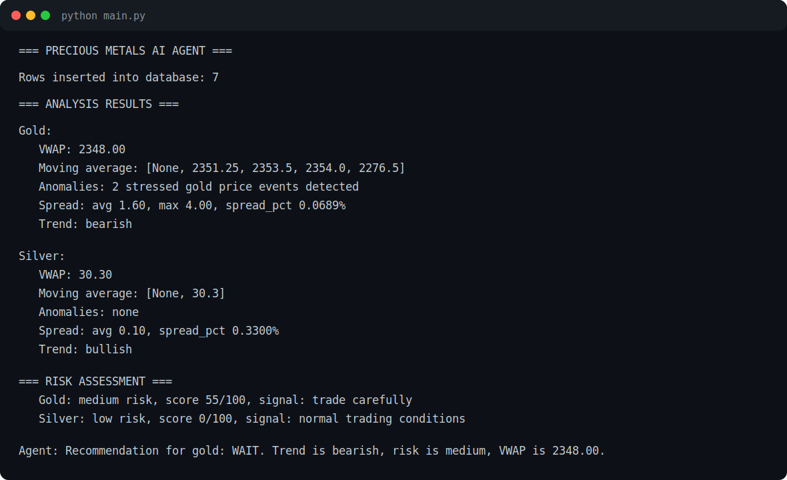

# Precious Metal Agent

## AI-Powered Precious Metals Trading Assistant

An intelligent trading assistant built with Python that simulates how modern trading desks can combine market data pipelines, financial analytics, risk assessment, and agentic AI workflows to generate market insights and trading recommendations.

The system collects and normalizes precious metals market data, performs quantitative analysis, evaluates trading risk, and uses a ReAct-style AI agent to answer trading-related questions through tool-calling and reasoning loops.

## Demo Output



Full output from the latest run is available here: [screenshots/run-output.txt](screenshots/run-output.txt)

## Project Highlights

### Market Data Pipeline

- Fetches data from multiple market sources.
- Handles inconsistent source formats.
- Retries failed API calls.
- Deduplicates records.
- Normalizes data into a unified schema.
- Stores market data in SQLite.

### Financial Analytics

The analysis engine calculates:

- Volume-Weighted Average Price (VWAP).
- Moving averages.
- Bid-ask spread analysis.
- Rolling z-score anomaly detection.
- Bullish, bearish, and neutral trend classification.

### Risk Assessment Engine

The system evaluates multiple market risk factors:

- Market spread stress.
- Price anomalies.
- Inventory coverage.
- Trend direction.
- Liquidity and volume decline.

It generates a risk score and classifies market conditions as:

- Low risk.
- Medium risk.
- High risk.

### Agentic AI Framework

A ReAct-style AI agent powers decision-making:

```text
Question
Reason
Select tool
Execute tool
Observe result
Generate answer
```

The agent can:

- Retrieve market prices.
- Calculate VWAP.
- Evaluate trends.
- Check inventory.
- Compare spreads.
- Generate trading recommendations.

## Example Agent Query

**User question**

```text
Should I buy gold?
```

**Agent reasoning**

```text
Trend = Bearish
Risk score = 55
Risk level = Medium
VWAP = 2348.00
```

**Agent response**

```text
Recommendation for gold: WAIT.
Trend is bearish, risk is medium (55/100), and VWAP is 2348.00.
```

## Architecture

```text
Market API layer
Data pipeline
SQLite storage
Analytics engine
Risk engine
Agent tools
ReAct agent
Trading recommendation
```

## Technology Stack

### Core

- Python 3.
- SQLite.
- Git.

### AI Engineering

- ReAct agent framework.
- Tool calling.
- Prompt engineering.
- Structured output parsing.
- Agent reasoning loops.

### Analytics

- Statistical analysis.
- VWAP calculation.
- Anomaly detection.
- Risk scoring.
- Trend analysis.

## Project Structure

```text
precious-metal-agent/
|-- main.py
|-- market_api.py
|-- pipeline.py
|-- analysis.py
|-- risk.py
|-- tools.py
|-- prompts.py
|-- agent.py
|-- requirements.txt
|-- screenshots/
|   |-- console-output.svg
|   `-- run-output.txt
`-- README.md
```

## Running The Project

Clone the repository:

```bash
git clone https://github.com/Amazing-P/precious-metal-agent.git
```

Navigate into the project:

```bash
cd precious-metal-agent
```

Create a virtual environment:

```bash
python -m venv venv
```

Activate the environment:

```bash
venv\Scripts\activate
```

Run the application:

```bash
python main.py
```

## Sample Output

```text
Gold VWAP: 2348.00
Trend: Bearish
Risk level: Medium
Risk score: 55/100

Agent recommendation:
Recommendation for gold: WAIT.
Trend is bearish, risk is medium (55/100), and VWAP is 2348.00.
```

## Skills Demonstrated

This project demonstrates practical experience in:

- Python software engineering.
- Data pipelines.
- API integration.
- Financial analytics.
- Risk modeling.
- Agentic AI.
- Prompt engineering.
- Tool calling.
- Structured output parsing.
- SQLite databases.
- ReAct agent design.

## Future Improvements

- Real-time market data integration.
- OpenAI or Claude API integration.
- FastAPI REST endpoints.
- Streamlit dashboard.
- Machine learning price forecasting.
- Portfolio optimization engine.
- Docker deployment.
- Cloud hosting.

## Disclaimer

This project is intended for educational, research, and portfolio purposes only.

It does not provide financial advice and should not be used for live trading decisions.
